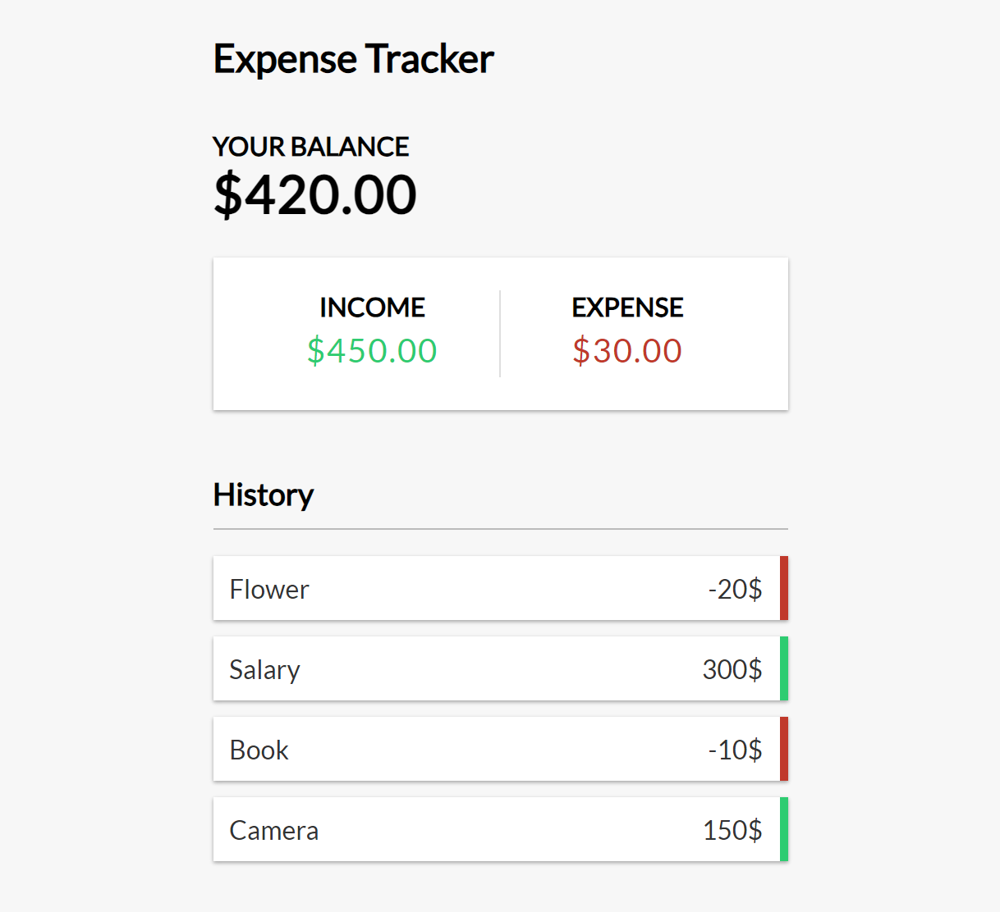

## Expense Tracker
Keep track of income and expenses. Add and remove items and save to local storage

## Project Specifications
- Create UI for project
- Display transaction items in DOM
- Show balance, expense and income totals
- Add new transaction and reflect in total
- Delete items from DOM
- Persist to local storage



## Run Locally

Clone the project

```bash
  git clone https://link-to-project
```

Go to the project directory

```bash
  cd my-project
```

Install dependencies

```bash
  npm install
```

Start the server

```bash
  npm run start
```

## Contributing

Contributions are always welcome!

See `contributing.md` for ways to get started. 

Please adhere to this project's `code of conduct`.


## Authors

- [@Adarsh Verma](https://www.github.com/AdarshTheki)


## 🔗 Links
[](https://katherineoelsner.com/)
[](https://www.linkedin.com/)
[](https://twitter.com/)

